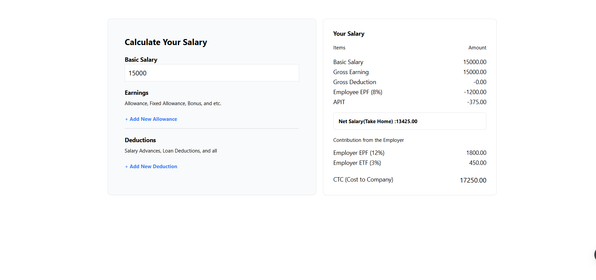
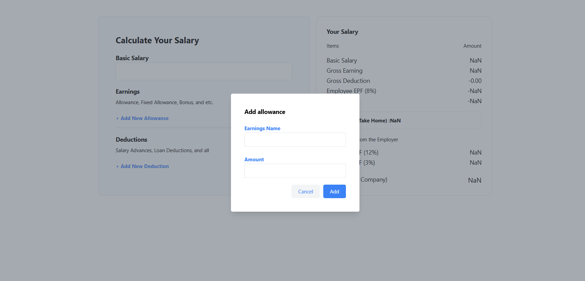
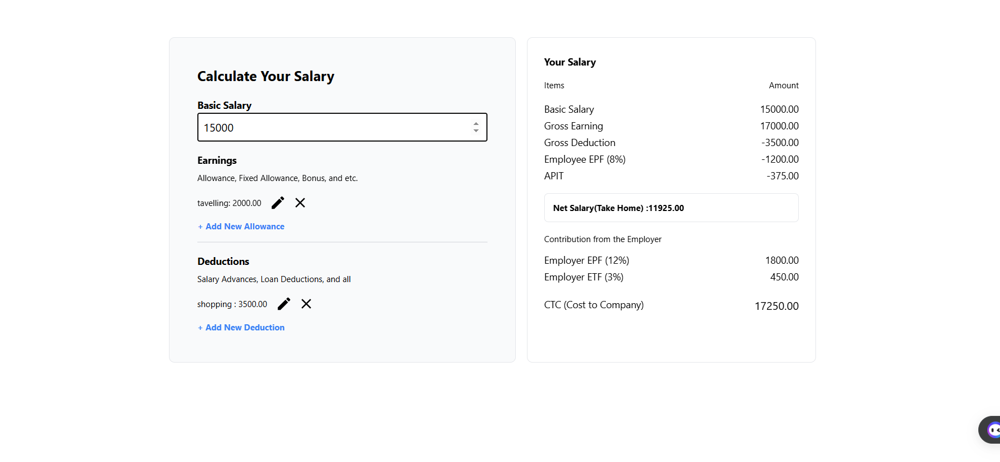
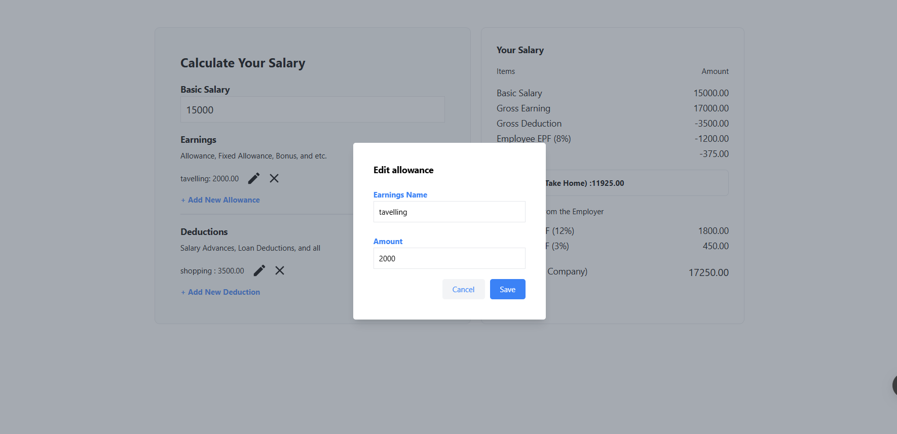

# Salary Calculator

A web application for calculating salaries with various allowances and deductions. Built using React, Redux, and Tailwind CSS.

## Features

- Add and edit basic salary, allowances, and deductions.
- Calculate net salary, gross earnings, and deductions.
- Display salary breakdown including employer contributions.
- Responsive design with Tailwind CSS.
- User-friendly interface with modal dialogs for adding/editing allowances and deductions.

## Live Demo

Check out the live demo [here]( https://dilshanmadhusanka.github.io/salary-calculator-2024-Q2-DilshanMadhusanka/).

## Application Screenshots 






## Installation

1. Clone the repository:

   ```bash
    https://github.com/DilshanMadhusanka/salary-calculator-2024-Q2-DilshanMadhusanka.git

2. Navigate to the project directory:

    ```bash
      cd salary-calculator
  
3. Install dependencies:

   ```bash  
     npm install


4. Start the development server:

   ```bash
     npm start

5. Open your browser and navigate to http://localhost:3000 to see the application in action.

## Usage

- Enter the basic salary in the input field.
- Click on "Add New Allowance" or "Add New Deduction" to open a modal and enter the details.
- Use the edit and delete buttons to modify or remove allowances and deductions.
- View the updated salary breakdown on the right panel.

  
## Technologies Used

- React: JavaScript library for building user interfaces.
- Redux: State management for React applications.
- Tailwind CSS: Utility-first CSS framework for styling.
- JavaScript: Programming language for the web.


## Contributing

Contributions are welcome! Please follow these steps:

- Fork the repository.
- Create a new branch: git checkout -b feature/your-feature-name.
- Make your changes and commit them: git commit -m 'Add some feature'.
- Push to the branch: git push origin feature/your-feature-name.
- Submit a pull request.


## Contact

If you have any questions or suggestions, feel free to reach out!

- Email: dilshanmadhusankaherath@gmail.com
- GitHub: DilshanMadhusanka
